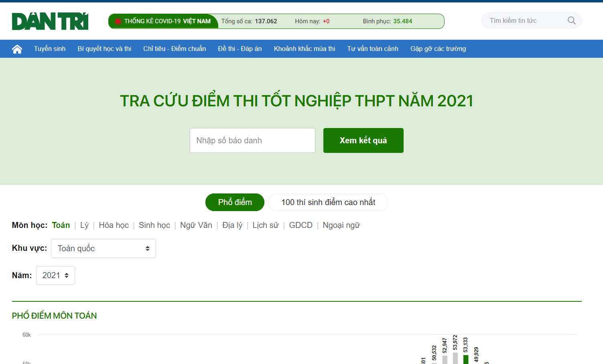

# Giới thiệu
Đây là 1 project nho nhỏ mình làm bằng C++, lưu lại ở đây để sau này thấy được quá trình mình làm và code ngu ntn thui :((

# Bước 1: Lấy dữ liệu từ website
Có rất nhiều website cung cấp dữ liệu về điểm thi 2021, nhưng ở đây mình chọn website của báo Dân Trí : `https://dantri.com.vn/giao-duc-huong-nghiep/tuyen-sinh/tra-cuu-diem-thi.htm` bởi vì web này cung cấp dữ liệu dạng `json` có thể lấy dễ dàng qua tab `Network` của `DevTools`
  

File `clone.cpp` giúp mình lấy dữ liệu về bằng cách sử dụng `curl` và cho dữ liệu thô vào file `textclone.txt`

Trong file hơn 8000 dòng đầu mình dùng Python để clone nên nó khác với những dòng sau. À, clone bằng `C++` có tốc độ vượt trội so với `Python` nên mình dùng `C++`

# Bước 2: Làm sạch dữ liệu
Sau khi đã có file txt thô thì việc làm sạch rất dễ dàng, chỉ cần có kiến thức về file và string là có thể làm được

File `clear.cpp` là code mình dùng để `clear` và cho nó vào `textclear.txt` - file này mình code mất khoảng 10p.
File này là file thứ 2 mình code, file thứ nhất có thêm tính toán theo các khối thi truyền thống nữa, nhưng vì 1 sự ngu người nên đã làm mất.

